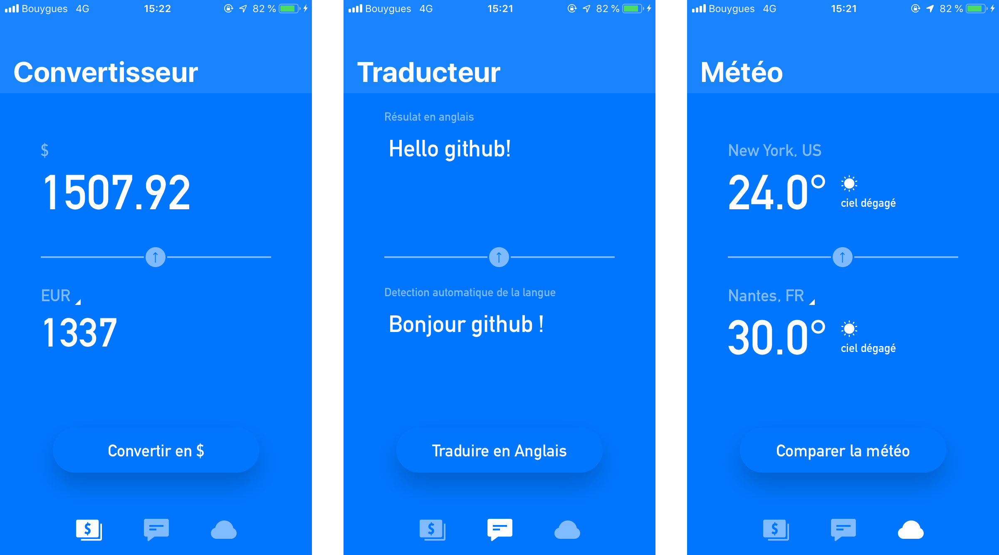

# Réaliser une application de voyage

## Attention !

Le fichier ApiKey.swift n'est pas présent car il contient ma clé Google. Pour builder le projet, vous devez créer votre fichier ApiKey.swift en mettant votre clé Google, comme ci dessous :

```
import Foundation

struct ApiKey {
    static let google = "YOUR_KEY_HERE"
    static let openWeather = "81bc1558721d4c8524058777780c933b"
    static let fixer = "6b9f932eab2fb32e5e0c1b3b6a078c45"
}
```

## Compétences à aquérir

- Effectuer des appels réseaux standards
- Faire une application avec plusieurs pages
- Gérer le clavier iOS, faire des tests unitaires pour les appels réseaux

## Bonus perso

- Redesign de l'app
- Persistance des données
- UITableView et SearchBar
- Détection automatique de la langue à traduire

## Screenshots de l'app


